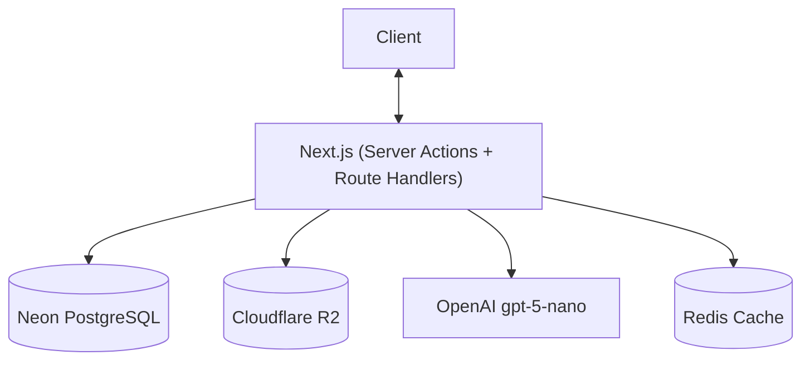
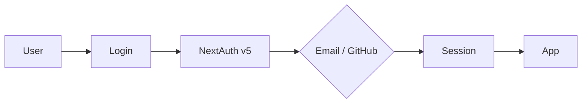
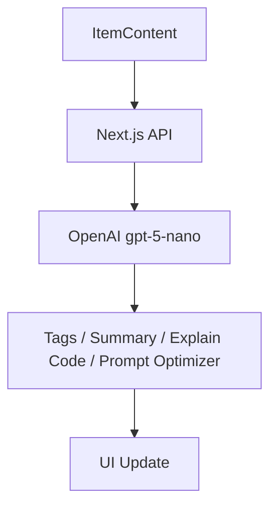

# DevStash — Store Smarter. Build Faster.

A centralized, AI-enhanced knowledge hub for developers to store and retrieve code snippets, AI prompts, notes, commands, files, images, and links — all in one searchable place.

---

## Problem

Developers keep their essentials scattered across tools with no single source of truth:

- Code snippets → VS Code / Notion
- AI prompts & context files → chat history / buried in projects
- Useful links → browser bookmarks
- Docs & templates → random folders
- Commands → `.txt` files or `bash_history`
- Project templates → GitHub Gists

**DevStash provides one fast, searchable, AI-enhanced hub for all dev knowledge.**

---

## Users

| Persona | Needs |
| ------- | ----- |
| Everyday Developer | Fast access to snippets, commands, links |
| AI-First Developer | Store prompts, contexts, workflows, system messages |
| Content Creator / Educator | Course notes, reusable code blocks, explanations |
| Full-Stack Builder | Patterns, boilerplates, API references |

---

## Features

### A) Item Types

Items have a type. System types are built-in and cannot be modified. Pro users can create custom types.

| Type | Icon | Color | Hex | Pro Only |
| ---- | ---- | ----- | --- | -------- |
| Snippet | `Code` | Blue | `#3b82f6` | No |
| Prompt | `Sparkles` | Purple | `#8b5cf6` | No |
| Note | `StickyNote` | Yellow | `#fde047` | No |
| Command | `Terminal` | Orange | `#f97316` | No |
| Link | `Link` | Emerald | `#10b981` | No |
| File | `File` | Gray | `#6b7280` | Yes |
| Image | `Image` | Pink | `#ec4899` | Yes |

> Icons from [Lucide](https://lucide.dev). URL paths follow the type name: `/items/snippets`, `/items/prompts`, etc.

Items are quickly accessed and created via a **drawer** (no full page navigation needed).

### B) Collections

Users create named collections that hold items of **any type**. An item can belong to **multiple collections** (e.g. a React snippet in both "React Patterns" and "Interview Prep"). Collections track when each item was added.

### C) Search

Full-text search across title, content, tags, and type.

### D) Authentication

Email + password or GitHub OAuth via [NextAuth v5 (Auth.js)](https://authjs.dev).

### E) Additional Features

- Favorites and pinned items (pin to top of list)
- Recently used items
- Import code from a file
- Markdown editor for text-based types
- File uploads for file/image types (Cloudflare R2)
- Export data as JSON or ZIP
- Dark mode by default
- Add/remove items to/from multiple collections
- View which collections an item belongs to

### F) AI Features (Pro only)

| Feature | Description |
| ------- | ----------- |
| Auto-tagging | Suggests relevant tags based on item content |
| AI Summary | One-line summary of an item |
| Explain Code | Plain-English explanation of a snippet |
| Prompt Optimizer | Rewrites prompts for clarity and effectiveness |

> Powered by **OpenAI gpt-5-nano**

---

## Data Model

> Starting point — will evolve as features are built. Tags are global (not per-user) for simplicity.

```prisma
model User {
  id                   String       @id @default(cuid())
  email                String       @unique
  password             String?
  isPro                Boolean      @default(false)
  stripeCustomerId     String?
  stripeSubscriptionId String?
  items                Item[]
  itemTypes            ItemType[]
  collections          Collection[]
  createdAt            DateTime     @default(now())
  updatedAt            DateTime     @updatedAt
}

model Item {
  id          String           @id @default(cuid())
  title       String
  contentType String           // "text" | "file" | "url"
  content     String?          // text content (null if file/url)
  fileUrl     String?          // Cloudflare R2 URL (null if text)
  fileName    String?
  fileSize    Int?             // bytes
  url         String?          // for link types
  description String?
  isFavorite  Boolean          @default(false)
  isPinned    Boolean          @default(false)
  language    String?          // for snippets/commands (e.g. "typescript")

  userId      String
  user        User             @relation(fields: [userId], references: [id])

  typeId      String
  type        ItemType         @relation(fields: [typeId], references: [id])

  collections ItemCollection[]
  tags        ItemTag[]

  createdAt   DateTime         @default(now())
  updatedAt   DateTime         @updatedAt
}

model ItemType {
  id          String       @id @default(cuid())
  name        String
  icon        String?
  color       String?
  isSystem    Boolean      @default(false) // true = built-in, cannot be deleted

  userId      String?
  user        User?        @relation(fields: [userId], references: [id]) // null for system types

  items       Item[]
  collections Collection[] @relation("DefaultType")
}

model Collection {
  id            String           @id @default(cuid())
  name          String
  description   String?
  isFavorite    Boolean          @default(false)
  defaultTypeId String?          // suggested type when adding new items
  defaultType   ItemType?        @relation("DefaultType", fields: [defaultTypeId], references: [id])

  userId        String
  user          User             @relation(fields: [userId], references: [id])

  items         ItemCollection[]
  createdAt     DateTime         @default(now())
  updatedAt     DateTime         @updatedAt
}

model ItemCollection {
  itemId       String
  collectionId String
  addedAt      DateTime   @default(now())

  item         Item       @relation(fields: [itemId], references: [id])
  collection   Collection @relation(fields: [collectionId], references: [id])

  @@id([itemId, collectionId])
}

model Tag {
  id    String    @id @default(cuid())
  name  String    @unique
  items ItemTag[]
}

model ItemTag {
  itemId String
  tagId  String

  item   Item @relation(fields: [itemId], references: [id])
  tag    Tag  @relation(fields: [tagId], references: [id])

  @@id([itemId, tagId])
}
```

---

## Tech Stack

| Category | Choice | Docs |
| -------- | ------ | ---- |
| Framework | Next.js 16 + React 19 (App Router) | [nextjs.org](https://nextjs.org) |
| Language | TypeScript (strict) | — |
| Database | Neon PostgreSQL | [neon.tech](https://neon.tech) |
| ORM | Prisma 7 | [prisma.io](https://www.prisma.io) |
| Caching | Redis (optional, later) | — |
| File Storage | Cloudflare R2 | [developers.cloudflare.com/r2](https://developers.cloudflare.com/r2) |
| CSS | Tailwind CSS v4 | [tailwindcss.com](https://tailwindcss.com) |
| UI Components | shadcn/ui | [ui.shadcn.com](https://ui.shadcn.com) |
| Auth | NextAuth v5 (Auth.js) | [authjs.dev](https://authjs.dev) |
| AI | OpenAI gpt-5-nano | [platform.openai.com](https://platform.openai.com) |
| Payments | Stripe | [stripe.com/docs](https://stripe.com/docs) |
| Deployment | Vercel | [vercel.com](https://vercel.com) |
| Monitoring | Sentry (later) | [sentry.io](https://sentry.io) |

> **NEVER** use `db push` or modify the DB directly. Always create migrations with `prisma migrate dev`, verify with `prisma migrate status`, and deploy with `prisma migrate deploy`.

---

## Architecture

### API



### Auth Flow



### AI Feature Flow



---

## UI / UX

- Dark mode by default, light mode optional
- Minimal, developer-focused — inspired by Notion, Linear, Raycast
- Syntax highlighting for code blocks
- Smooth transitions, hover states, toast notifications, loading skeletons

## Screenshots

Refer to the screenshots below as a base for the dashboard UI. It does not have to be exact. Use it as a reference:

- @context/screenshots/dashboard-ui-main.png
- @context/screenshots/dashboard-ui-drawer.png

### Layout

- **Sidebar** (collapsible → drawer on mobile): item type links + latest collections
- **Main workspace**: grid of color-coded collection cards (background color = dominant item type). Items display as color-coded cards (border = type color)
- **Drawer**: individual items open in a quick-access drawer — no full page navigation

### Responsive

- Desktop-first, mobile usable
- Sidebar collapses to drawer on mobile
- Touch-optimized icons and controls

---

## Monetization

| Plan | Price | Items | Collections | File/Image Uploads | AI Features | Custom Types | Export |
| ---- | ----- | ----- | ----------- | ------------------ | ----------- | ------------ | ------ |
| Free | $0 | 50 | 3 | No | No | No | No |
| Pro | $8/mo or $72/yr | Unlimited | Unlimited | Yes | Yes | Yes | JSON / ZIP |

> Payments via **Stripe** (subscriptions + webhooks to sync `isPro` on `User`).  
> During development, all users have access to all features.

---

## Roadmap

### MVP
- [ ] Items CRUD (all non-pro system types)
- [ ] Collections (many-to-many with items)
- [ ] Tags
- [ ] Full-text search
- [ ] Auth (email + GitHub)
- [ ] Free tier limits

### Pro Phase
- [ ] File & image uploads (Cloudflare R2)
- [ ] AI features (auto-tag, summarize, explain, optimize)
- [ ] Custom item types
- [ ] Export (JSON / ZIP)
- [ ] Billing & upgrade flow (Stripe)

### Future
- [ ] Shared collections
- [ ] Team / Org plans
- [ ] VS Code extension
- [ ] Browser extension
- [ ] Public API + CLI

---

## Development Workflow

- **One branch per lesson** — students can follow and compare
- Branch naming: `lesson-01-setup`, `lesson-02-auth`, etc.
- See [ai-interaction.md](./ai-interaction.md) for the full feature workflow
- See [coding-standards.md](./coding-standards.md) for code conventions
